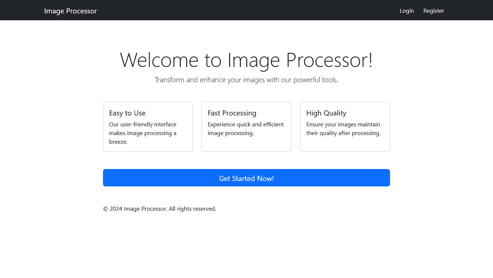
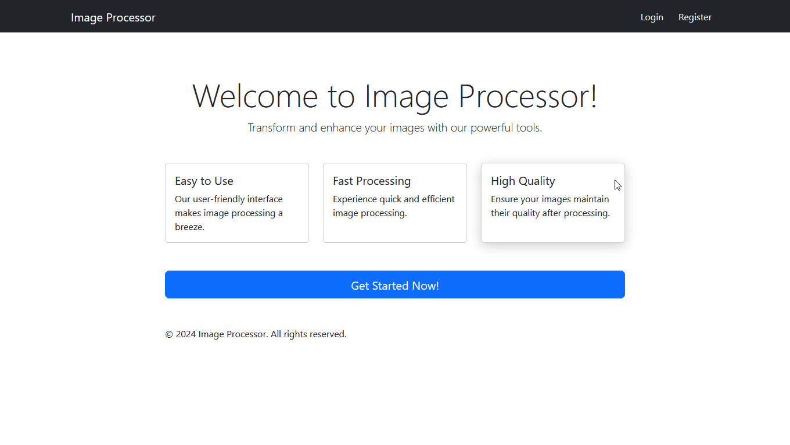
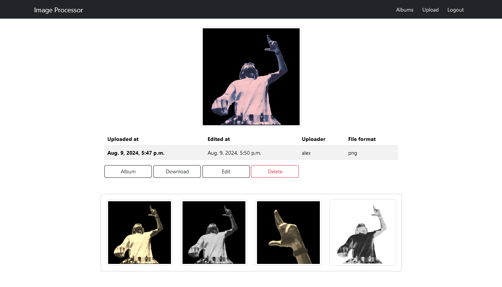

# Image Processor

    

 

    

 

    

---

 

Simple Django Web App for editing images and organaize them in albums.

### Video Demo 
Here --> [Google Drive](https://drive.google.com/file/d/15N-mUF61Lx7gaFOrbA4sZzXO4bIuq8Dh/view?usp=drivesdk)

### Stack
- **Python**
- **Django**
- [**PIL (pillow)**](https://github.com/python-pillow/Pillow)
- [**Bootstrap**](https://getbootstrap.com/)
- [**cropper.js**](https://fengyuanchen.github.io/cropperjs/)
- [**NumPy**](https://numpy.org/)
- **HTML + CSS3 + JavaScript**
